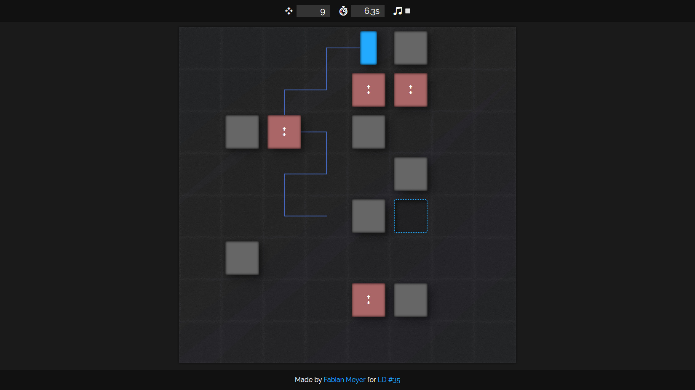

# CubeShift

CubeShift is my entry for the 35th iteration of the Ludum Dare gamejam, in which the theme was "Shapeshift".

In this game, you'll find yourself moving a blue cuboid through parcour-like levels.
Your movements are limited to the your current orientation. Moreover, the orientation changes with each move, leading to the shift in shape.

## Screenshots

